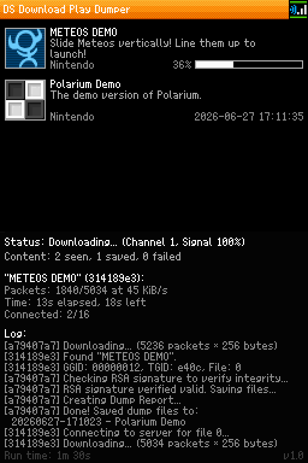

# dlpdump – DS Download Play Dumper

This is a Nintendo DS homebrew project for preserving DS Download Play content in a verifyable way. It behaves like a local DS Download Play program, captures the transmitted multiboot payload, reconstructs it as a bootable `.nds` and `.bcn` file combination, and writes useful sidecar files for diagnostics and reproducibility.

A dump report will be automatically generated with CRC32, MD5, SHA-1 and SHA-256 hashes and various useful information related to the dump. The program can take advantage of TWL mode to calculate these hashes faster; tested on a DSpico.



## Usage

Copy `dlpdump.nds` to a DLDI-capable flash card’s storage media and run it on DS-compatible hardware. After startup, the application creates `/dlpdump`, scans automatically for DS Download Play hosts, and starts suitable downloads on its own.

For RSA signature verification, provide the 128-byte DS Download Play public key as `/dlpdump/pubkey.bin` on the flash card storage media. The key is not redistributed with this project. Its SHA-1 hash is `78cca7e87c5f8e1f1eddfe57d7755e7b3de5232e`. RSA signature verification validates the integrity of a dump. Validated dumps can then also be launched.

| Button | Action |
|---|---|
| `B` | cancel the current download; skip generating a dump report |
| `START` | launch the most recent saved dump if a matching `.nds`/`.bcn` pair exists and RSA signature verification passes |
| `X` | toggle repeated downloads of already saved content |
| `L`+`R`+`A`+`B`+`DOWN` | exit the application |

## Output files

All files are written to `/dlpdump`. The base filename contains a timestamp and title, for example `YYYYMMDD-HHMMSS - <Title>`.

| File | Contents |
|---|---|
| `.nds` | reconstructed ROM file (consisting of header, ARM9 and ARM7 parts and the RSA signature, all carefully placed in the areas as specified by the header data) |
| `.bcn` | broadcast context (icon graphic, game title, game description, host name, game group ID and user parameters for later booting) |
| `.txt` | human-readable dump report with CRC32, MD5, SHA-1 and SHA-256 hashes, decoded ROM header data, broadcast context, and transfer counters |

Only created by the debug version:

| File | Contents |
|---|---|
| `.pcap` | IEEE 802.11 diagnostic capture of relevant beacon and download traffic; should not be shared as it may include personal data |
| `.log` | log file for debugging purposes |

## Build

Requirements:

- devkitPro / devkitARM
- libnds
- Calico DS libraries
- ndstool
- Python 3 for generated assets

```sh
export DEVKITPRO=/opt/devkitpro
export DEVKITARM=$DEVKITPRO/devkitARM
make
```

The debug version for diagnostic purposes can be built with `make debug`.

## Disclaimer

Use the program only for your own authorized backup, analysis, interoperability, and compatibility testing. Respect local laws and the rights attached to games and transmitted content. The main reference used is [GBATEK](https://problemkaputt.de/gbatek.htm) by Martin Korth. This project does not include original Nintendo code. GPT-5.5 was used as a coding assistant in this project.

## License

The main project code is licensed under GPL-3.0. Third-party and derived components are listed in `THIRD_PARTY_NOTICES.md`, including [Calico](https://github.com/devkitPro/calico)-related files and [Pico Loader](https://github.com/LNH-team/pico-loader)-based boot/handoff code.
